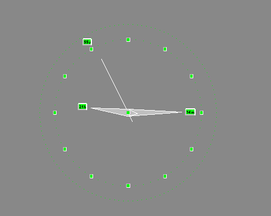



## AnalogoDigital clock savescreen

### Description

A savescreen showing an analog/digital clock bouncing on the screen borders
 
### More Info
 
The parameters that you can set: Diameter, speed, backcolor etc...

This application use The "Minimum code to create a screen saver using Visual Basic created by Igguk E-Mail : pcharles@swing.be" that you can find on Planet-source-code, and add to that the way to design a moving clock using Visual Basic code and API functions...

Tested only in Windows NT 4.0 ...

             |
---                |---
**Submitted On**   |2001-07-31 21:11:16
**By**             |[Ghislain Chabot](https://github.com/Planet-Source-Code/PSCIndex/blob/master/ByAuthor/ghislain-chabot.md)
**Level**          |Advanced
**User Rating**    |4.7 (14 globes from 3 users)
**Compatibility**  |VB 6\.0
**Category**       |[Complete Applications](https://github.com/Planet-Source-Code/PSCIndex/blob/master/ByCategory/complete-applications__1-27.md)
**World**          |[Visual Basic](https://github.com/Planet-Source-Code/PSCIndex/blob/master/ByWorld/visual-basic.md)
**Archive File**   |[AnalogoDig238467312001\.zip](https://github.com/Planet-Source-Code/ghislain-chabot-analogodigital-clock-savescreen__1-25704/archive/master.zip)

### API Declarations

in the zip file .bas...

